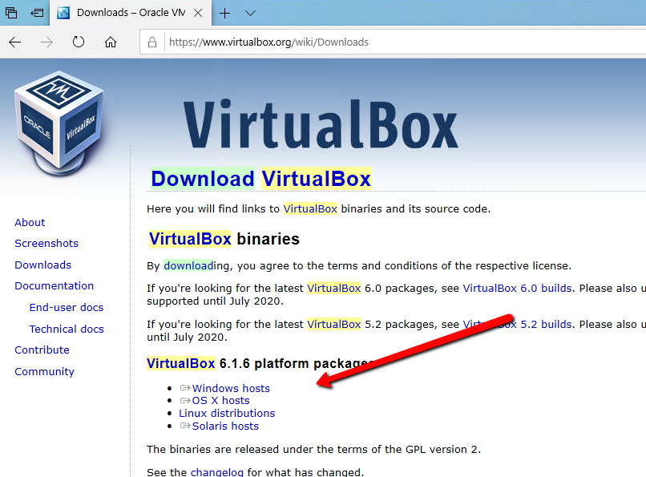
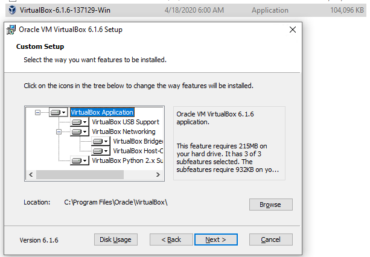

# mmbot-virtualbox-image
This repository contains Virtualbox image with preinstalled and preconfigured [mmbot](https://github.com/ondra-novak/mmbot/) for crypto algo trading. 

This is [VirtualBox](https://www.virtualbox.org/) image disk have preinstalled
 [Ubuntu 18.04 LTS](https://ubuntu.com/#download). 

# Prerequisites 

You should be familiar with PC virtualisation, linux basics and [mmbot](https://github.com/ondra-novak/mmbot/) usage. 

Please notice that **ALL credentials** are:

* user: *mmbot*
* password: *mmbot*

# Installation

## 1. Download and extract image

Download this whole package from sourceforge [https://sourceforge.net/projects/mmbot-virtualbox-image/files/mmbot-virtualbox-image.zip/download](https://sourceforge.net/projects/mmbot-virtualbox-image/files/mmbot-virtualbox-image.zip/download) and then extract files on your hard drive.

## 2. Install VirtualBox 

Download and install [VirtualBox](https://www.virtualbox.org/). Disk has been created and tested on version 6.1.6.






## 3. Add image to the VirtualBox

After installation run VirtualBox, you should see it like this. 


Then click on plus button and search for your extracted mmbox.vbox file, and you should see added image like this.


## 4. Run mmbot 

Doubleclick on your added image. After a few minutes Ubuntu will load and you should see desktop like this. 


To run **mmbot** double click on **run.sh**, after a few seconds Firefox browser 
will load http://localhost:10000 mmbot ready to go. 


For manual, please refer original mmbot repository [https://github.com/PayteR/mmbot-virtualbox-image](https://github.com
/PayteR/mmbot-virtualbox-image)

## 5. Update mmbot inside image

For update mmbot you need to do that manually in console. Run terminal and execute this commands:

```
cd Desktop/mmbot/
./update
```


# FAQ

**Q: Why image is not included in GIT?**<br>
A: It's not possible to store files that are bigger than 2GB on Github

